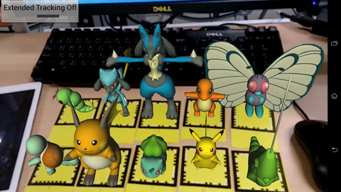
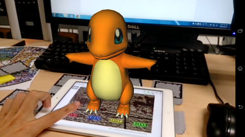
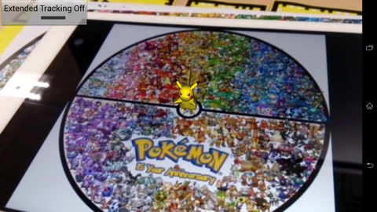
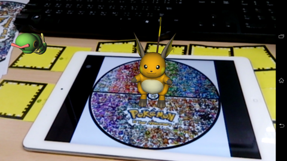

PokemonAR
=========
Exploit [Vuforia](https://developer.vuforia.com/) and [Rajawali](https://github.com/MasDennis/Rajawali) to build simple interactive Pokemon AR game on Android.

##Screenshots
  
  
   
Evolve your Pikachu by feeding (touching) it  

##Libraries
- Vuforia 2.8.8
- Rajawali - [my forked ver.](https://github.com/sh1r0/Rajawali)
- RajawaliVuforia - [my forked ver.](https://github.com/sh1r0/RajawaliVuforia)

##Credits
- Pokemon models - http://roestudios.co.uk/project/3d-pokemon-models/
